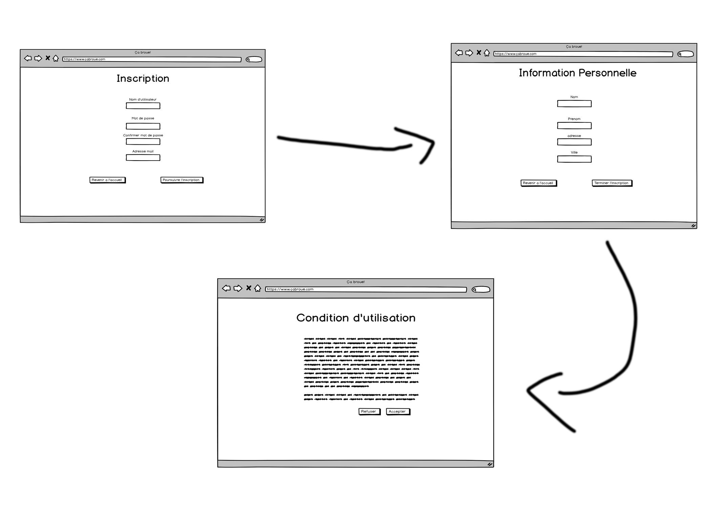
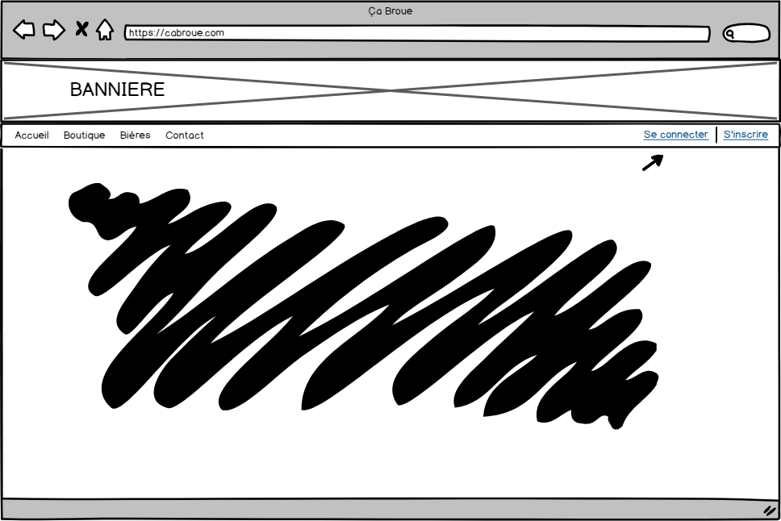
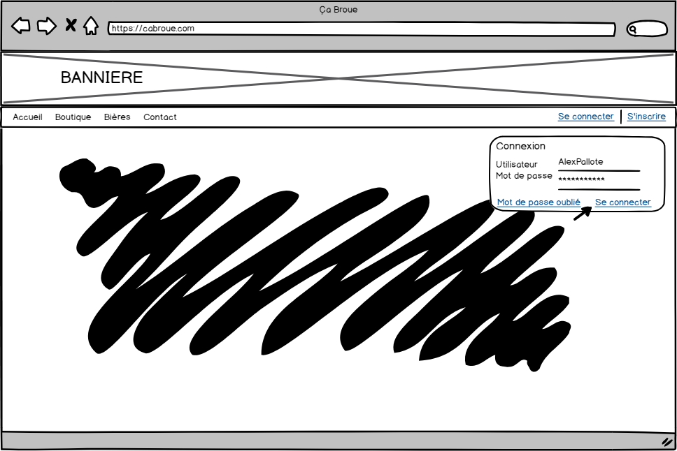
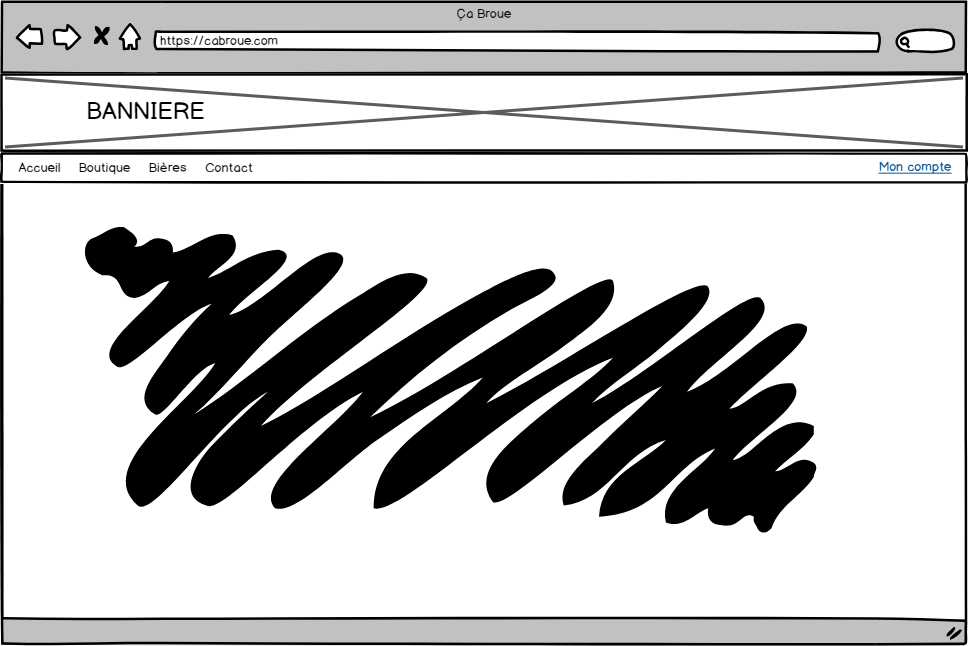
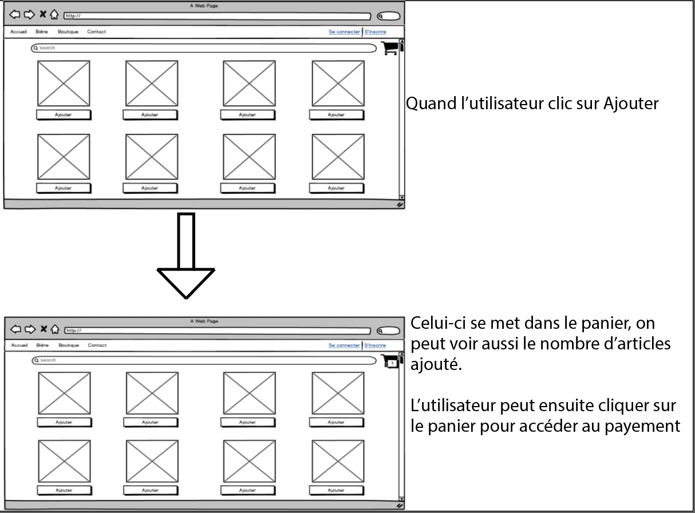
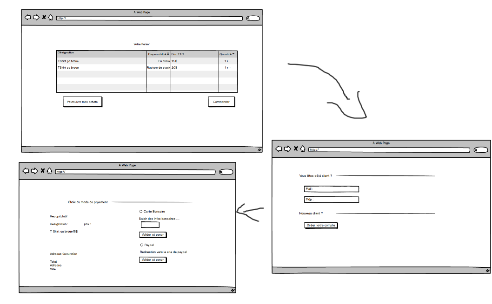

# Les Storyboards de Ça broue

---

<!-- MDTOC maxdepth:6 firsth1:1 numbering:0 flatten:0 bullets:1 updateOnSave:1 -->

- [Les Storyboards de Ça broue](#les-storyboards-de-ça-broue)
    - [Permettre à l'utilisateur d'afficher les goodies de la boutique](#permettre-à-lutilisateur-dafficher-les-goodies-de-la-boutique)
    - [Permettre à l'utilisateur de s'inscrire](#permettre-à-lutilisateur-de-sinscrire)
    - [Permettre à l'utilisateur de se connecter sur le site](#permettre-à-lutilisateur-de-se-connecter-sur-le-site)
    - [Permettre à l'utilisateur d'ajouter un article au panier](#permettre-à-lutilisateur-dajouter-un-article-au-panier)
<!-- /MDTOC -->

### Permettre à l'utilisateur d'afficher les goodies de la boutique

Alexandre Beauquel

---

### Permettre à l'utilisateur de s'inscrire

À partie de la page d'inscription, l'utilisateur entre les informations de connexion qu'il désire puis son adresse mail. Par la suite, l'utilisateur appuie sur poursuivre.
Sur la deuxième page, l'utilisateur peut entré ses informations personnelles pour l'achat en boutique. Ensuite, l'utilisateur appuie sur poursuivre.
La troisieme page sert au conditions d'utilisations. l'utilisateur oeut choisir de les apcepter ou non.
  
Sedrick Levesque

---

### Permettre à l'utilisateur de se connecter sur le site
***Michael Turcotte***

À partir de la bar de navigation du site (situé en haut), l'utilisateur peut utiliser la fonctionnalité connexion en cliquant sur *Se connecter* situé à droite de la bar de navigation.

Après avoir appuyer sur *Se connecter*, un petit rectangle apparait demandant d'y insérer les informations de connexion.

Un coup les informations saisient, l'utilisateur peut appuyer sur le bouton *Se connecter* en bas à droite du rectangle pour se connecter à son compte.

Si la connexion c'est affectué sans embauche, *Se connecter* et *S'inscrire* dans la bar de navigation seront remplacé par *Mon compte*.

---

### Permettre à l'utilisateur d'ajouter un article au panier
Alec Pallot

### Permettre à l'utilisateur de voir le panier et de payer le contenu de son panier 
Florian LEVY

